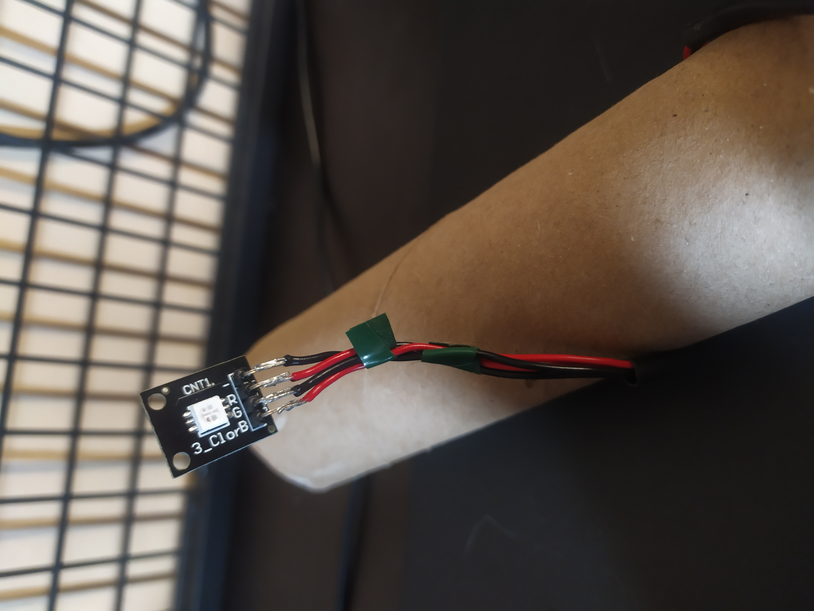

# Table of Contents

1.  [Lámpara Web con ESP32](#orgb5d49e6)
    1.  [Materiales](#orge13cc4e)
    2.  [Herramientas usadas](#orgca8bf03)
    3.  [Conexión](#org8ef3b0c)
    4.  [Modos y valores del módulo](#org0b194a8)
    5.  [Librerías](#org11889a9)
    6.  [Pines usados](#org4139a1e)
    7.  [Conectarse a la red](#orgcb3fad6)
    8.  [Server y headers](#org758d989)
    9.  [Variables de control y valores iniciales](#org5a28244)
    10. [HTML a enviar al cliente](#org5ee881f)
    11. [HTML enviado](#orge9d3ff5)
    12. [setup()](#orgfa9c7c9)
        1.  [pinMode](#org6265888)
        2.  [Conexión al WiFi](#org9250df5)
        3.  [Iniciar el server](#org85d3ebd)
    13. [loop()](#orgf12baa8)
    14. [Escuchar clientes](#org26e91c1)
    15. [Manejar nuevos clientes](#orgc6a6fc1)
    16. [Manejar el contenido del header](#org9b7a69a)
    17. [led<sub>toggle</sub>](#org1ed9f68)
    18. [rainbow<sub>mode</sub>](#org08d06d9)
2.  [Imágenes](#org81f96a2)
3.  [Resultado final](#org4a2bc88)
    1.  [main.cpp](#org8806ff5)
    2.  [index.html](#orge395591)
4.  [curl y alias en zsh](#org3e736ce)


<a id="orgb5d49e6"></a>
# Lámpara Web con ESP32


Es una lámpara hecha con una ESP32 (similar a un arduino).
La ESP32 cuenta con capacidades Bluetooth y WiFi.
Esto quiere decir que podemos crear un web server para aceptar HTTP requests.
De acuerdo a estas requests, podemos enviar cierto contenido.

Por ejemplo, podemos enviar un html.
O también podemos leer el contenido del request para saber si tenemos que hacer una acción especial como encender el led.

Usando un led RGB, me propuse a crear una lámpara LED que se pueda encender desde un dispositivo remoto conectado a la misma red que la ESP32.
Mostrándole una página simple en html que permita encenderla y apagarla.
También hice un intento de hacer un efecto de rainbow RGB.


<a id="orge13cc4e"></a>
## Materiales

-   ESP32
-   Módulo LED KY-009
-   Alambre 22 awg
-   Tubo de cartón reciclado


<a id="orgca8bf03"></a>

## Herramientas usadas

-   Editor: VSCode y Neovim.
-   PlatformIO: es la plataforma que te permite crear proyectos de Arduino, tiene plugins que se pueden instalar para ambos editores que usé. Te permite compilar y subir tus programas al ESP32 sin necesidad de usar ArduinoIDE.


<a id="org8ef3b0c"></a>
## Conexión

Usando pedazos de 30cm de alambre de 22 awg conecté el led al ESP32.




<a id="org0b194a8"></a>

## Modos y valores del módulo

Para este proyecto, considero tener dos modos: un modo básico en el cual la luz es totalmente blanca.
La otra es un modo rainbow, en el cual voy cambiando los valores para cada color.
Para cada color, podemos escribir en el pin un valor entre 0 y 255.
O es que el led de ese color está totalmente apagado, 255 es que el led de ese color tiene el brillo máximo posible.
Entonces, el modo rainbow va consistir en iterar sobre esos valores para cada uno de los 3 colores.


<a id="org11889a9"></a>

## Librerías

```cpp
#include <Arduino.h>
#include <WiFi.h>
```

Dentro de PlatformIO, necesitamos usar la librería de `Arduino.h`, en ArduinoIDE esta se importa automáticamente.
Como vamos a necesitar de una forma de conectarnos a la red, `WiFi.h` es la librería que nos permite hacerlo.
Ambas librerías deberían estar instaladas por defecto junto a PlatformIO.


<a id="org4139a1e"></a>

## Pines usados

```cpp
// RGB LED Module PINS
#define RGB_RED_PIN 12
#define RGB_BLUE_PIN 14
#define RGB_GREEN_PIN 27
```

El módulo KY-009 necesita de 4 pines.
3 para cada color y un último para el GND.
En mi caso, escogí los pines 12, 14 y 27 porque son los que están más cerca del pin GND de la placa ESP32.


<a id="orgcb3fad6"></a>

## Conectarse a la red

Necesitamos indicarle a la placa las credenciales necesarias para conectarse al WiFi.
Según las credenciales de nuestra red WiFi tenemos que cambiarlos

```cpp
// WiFi Credentials
const char* ssid = "Follow the Kittens"; // Name
const char* password = "TuringFelix49";  // Password
```


<a id="org758d989"></a>

## Server y headers

Creamos un objeto tipo WiFiServer.
Y también una variable tipo string que nos permita guardar lo que obtenemos de los requests del cliente.

```cpp
// Creates an server object in port 80
WiFiServer server(80);

// Variable that saves petitions from client
String header;
```


<a id="org5a28244"></a>

## Variables de control y valores iniciales

```cpp
// Led power status
char power_status = 0;
// Is the rainbow_mode active? 0 for not, 1 for yes
char rainbow_status = 0;
// Counter that help us to decise when to change de color in rainbow_mode
int rainbow_counter = 0;
// Initial values for heach color to make it more dinamic
short blue_value = 1;
short red_value = 31;
short green_value = 101;
```

Definimos algunas variables para guardar el estado de un modo.
El modo principal es `power_mode`, permite apagar y encender la luz blanca.
El `rainbow_mode` es el que va a permitir cambiar el valor de los colores.
Tenemos un contador de `rainbow_mode` para saber cuando cambiar de color.
Y por último, definimos unos valores aleatorios para los colores para cuando se quiera hacer el efecto de rainbow.


<a id="org5ee881f"></a>

## HTML a enviar al cliente

```cpp
// Content sent to client
const char *HTML =
 #include "index.html"
;
```

Cómo tenemos un servidor web, necesitamos que cuando alguien se conecte al server obtenga una respuesta que le permita interactuar con la lógica de la ESP32.

En este caso, vamos a enviar una página HTML que contiene dos botones: una para cada uno de los modos.
En este archivo también podemos incluir estilos CSS con la etiqueta `<style></style>`.
Y también podemos implementar lógica más compleja con la etiqueta `<script></script>` y usando Javascript.

Entonces, debemos crear este archivo para que sea leído por el compilador y lo ponga en el programa final del ESP32:

```html
R"=====(
<!DOCTYPE HTML>
<html>
<head>
  <meta name="viewport" content="width=device-width, initial-scale=1">
  <link rel="icon" href="data:,">

  <style>
  html {
    font-family: Helvetica;
    display: inline-block;
    margin: 0px auto;
    text-align: center;
  }
  .button {
    background-color: #4CAF50;
    border: none;
    color: white;
    padding: 16px 40px;
    text-decoration: none;
    font-size: 30px;
    margin: 2px;
    cursor: pointer;
  }
  .button:hover {
    background-color: #d0eed1;
    color: rgb(0, 0, 0);
    transition: 1s;
  }
  .button2 {
    border: none;
    color: white;
    padding: 16px 40px;
    text-decoration: none;
    font-size: 30px;
    margin: 2px;
    cursor: pointer;
    background: linear-gradient(
        90deg,
        rgba(255, 0, 0, 1) 0%,
        rgba(255, 154, 0, 1) 10%,
        rgba(208, 222, 33, 1) 20%,
        rgba(79, 220, 74, 1) 30%,
        rgba(63, 218, 216, 1) 40%,
        rgba(47, 201, 226, 1) 50%,
        rgba(28, 127, 238, 1) 60%,
        rgba(95, 21, 242, 1) 70%,
        rgba(186, 12, 248, 1) 80%,
        rgba(251, 7, 217, 1) 90%,
        rgba(255, 0, 0, 1) 100%
    );
  }
  </style>
</head>

<body>
  <h1>Lampara ESP32</h1>
  <button class="button" onclick="send('toggle');">Toggle Power</button>
  <br/>
  <button class="button2" onclick="send('rainbow');">Rainbow Mode</button>

  <script>
    let xhr = new XMLHttpRequest()

    function send(cmd){

      xhr.open("GET", "/" + cmd, true);
      xhr.send(null);
    }
  </script>
</body>

</html>
)====="
```

Nótese que necesitamos en la primera y última línea un conjunto de caracteres que le dicen a C que debe leer este archivo como un texto que va a convertir en un string.
Dentro del HTML podemos meter Javascript, en este caso yo puse una función que hace un HTTP resquest al mismo server con cierto header y que va a leer el ESP32 para detectar la acción que queremos hacer.


<a id="orge9d3ff5"></a>

## HTML enviado

Así se ve el html enviado.


<a id="orgfa9c7c9"></a>

## setup()

En la función de `setup()` del Arduino vamos a inicializar el led en 0 todos los colores, y también iniciar la conexión y el servidor.


<a id="org6265888"></a>

### pinMode

Pero antes debemos poner el modo de los pines a `OUTPUT`  para poder escribir valores entre 0 a 255 a cada pin.

```cpp
// Setup pins
pinMode(RGB_BLUE_PIN, OUTPUT);
pinMode(RGB_GREEN_PIN, OUTPUT);
pinMode(RGB_RED_PIN, OUTPUT);

// Initialises RGB LED
analogWrite(RGB_BLUE_PIN, 0);
analogWrite(RGB_RED_PIN, 0);
analogWrite(RGB_GREEN_PIN, 0);
```


<a id="org9250df5"></a>

### Conexión al WiFi

Anteriormente, creamos variables para las credenciales de nuestro WiFi, ahora las vamos a usar para hacer la conexión.

```cpp
// Connect to WiFi using credentials
WiFi.begin(ssid, password);
// Waits for connection for complete
while (WiFi.status() != WL_CONNECTED) {
  delay(500);
}
```

Cómo la conexión puede tardar a veces, es necesario forzar a confirmar la conexión para seguir con los demás procesos.


<a id="org85d3ebd"></a>

### Iniciar el server

Ya definimos el puerto del servidor, en 80.
Después de conectarnos a la red, podemos iniciar el servidor.

```cpp
// Starts the web server
server.begin();
```


<a id="orgf12baa8"></a>

## loop()

Dentro del `loop()`, lo que hacemos es aceptar nuevos clientes, si un nuevo cliente se conecta, tenemos una función que se encarga de manejar el header obtenido del cliente para poder después decidir qué hacer a partir de esta petición.
También hacemos el manejo de el cambio de colores si el modo rainbow está activo.


<a id="org26e91c1"></a>

## Escuchar clientes

Tenemos que estar activamente escuchando por nuevos clientes.

```cpp
// Listen for incoming clients
WiFiClient client = server.available();


// If a new client connects
if (client) {
  // Handle the client and set the headers
  handle_client(client, header);
}
```


<a id="orgc6a6fc1"></a>

## Manejar nuevos clientes

```cpp
void handle_client(WiFiClient client, String header){
  // Make a String to hold incoming data from the client
  String currentLine = "";

  // Loop while the client's connected
  while (client.connected()) {

    // If there's bytes to read from the client,
    if (client.available()) {

      // Read a byte
      char c = client.read();

      // Adds client's data to header variable
      header += header + c;

      // If the byte is a newline character
      if (c == '\n') {
      // If the current line is blank, you got two newline characters in a row
      // that's the end of the client HTTP request, so send a response:

        if (currentLine.length() == 0) {
          // HTTP headers always start with a response code (e.g. HTTP/1.1 200
          // OK) and a content-type so the client knows what's coming, then a
          // blank line:
          client.println("HTTP/1.1 200 OK");
          client.println("Content-type:text/html");
          client.println("Connection: close");
          client.println();

          // Reacts to header's content
          handle_header(header);

          // Sends html page to client
          client.println(HTML);

          // To end the response to client, print an empty line
          client.println();

          // Break connection to client
          break;

        // Cleans contens readed from client
        } else {
          currentLine = "";
        }

      } else if (c != '\r'){
        currentLine += c;
      }
    }
  }

  // Clear the header variable
  header = "";

  // Close the connection
  client.stop();
}
```

Primero tenemos una variable que vamos a usar para guardar el contenido enviado por el cliente.
Mientras el cliente nos está enviando información seguimos en el bucle.
Luego hacemos el read de la petición del cliente, primero debemos saber si tenemos algo enviado.

```cpp
char c = client.read();
```

Vamos leyendo char por char hasta que llegemos a un símbolo de nueva línea.

```cpp
if (c == '\n') {
```

Cuando obtenemos ese último caracter, ya podemos empezar a analizar su contenido, pero primero debemos cerrar la conexión.
Para cerrar la conexión le enviamos un mensaje al cliente de con el response de OK.
Hacemos esto usando la instrucción `println()`.

```cpp
client.println("HTTP/1.1 200 OK");
client.println("Content-type:text/html");
client.println("Connection: close");
client.println();
```

Luego de cerrar la conexión, pasamos a análizar el contenido del header.

```cpp
handle_header(header);
```

Luego de manejar el header y hacerlas acciones correspondientes, debemos enviar algo en respuesta.
En este caso, enviamos un archivo html.

```cpp
client.println(HTML);
client.println();
```

Es necesario enviar una linea vacia para que el cliente entienda que es el fin del response.


<a id="org9b7a69a"></a>

## Manejar el contenido del header

Una vez ya tenemos todo el contenido del header, es necesario detectar las operaciones que nos pide el usuario.
En mi caso, utilicé peticiones GET a dos direcciones para cambiar entre los modos.

Podemos leer en el header una HTTP request que podemos interpretar para realizar ciertas acciones.

```cpp
// Handle contents in header
void handle_header(String header){
  // Reacts to header's content
  if (header.indexOf("GET /toggle") >= 0) {
    led_toggle();
  } else if (header.indexOf("GET /rainbow") >= 0){
    rainbow_mode();
  }
}
```

De esta manera vemos que podemos interpretar dos casos: el toggle del modo normal (que al mismo tiempo apaga el led sin importar el modo que esté).
También detectamos que puede haber una petición que quiere iniciar el modo rainbow.


<a id="org1ed9f68"></a>

## led_toggle

El Led cuando está en modo normal se considera encendido, si está en modo rainbow también se considera encendido.
Cuando llamamos a esta función queremos saber si el led está encendido en cualquier modo.
Si es el caso, lo apagamos.

```cpp
// Toggles led power
void led_toggle(){
  if (power_status) {
    power_status = 0;
    rainbow_status = 0;
    led_off();
  } else {
    power_status = 1;
    led_on();
  }
}
```

Si sucede que el led está apagado, se enciende en modo normal.


<a id="org08d06d9"></a>

## rainbow<sub>mode</sub>

Esta función es similar a la de toggle, pero en lugar de encender en modo normal, empieza a hacer el efecto de rainbow.

```cpp
// Turns rainbow_mode on
void rainbow_mode(){
  if (rainbow_status) {
    power_status = 0;
    rainbow_status = 0;
    led_off();
  } else {
    power_status = 1;
    rainbow_status = 1;
  }
}
```


<a id="org81f96a2"></a>

# Imágenes


<a id="org4a2bc88"></a>

# Resultado final


<a id="org8806ff5"></a>

## main.cpp

Es todo el código que corre el ESP32:

```cpp
#include <Arduino.h>
#include <WiFi.h>

// RGB LED Module PINS
#define RGB_RED_PIN 12
#define RGB_BLUE_PIN 14
#define RGB_GREEN_PIN 27

// WiFi Credentials
const char* ssid = "Follow the Kittens"; // Name
const char* password = "TuringFelix49";  // Password

// Creates an server object in port 80
WiFiServer server(80);

// Variable that saves petitions from client
String header;

// Led power status
char power_status = 0;
// Is the rainbow_mode active? 0 for not, 1 for yes
char rainbow_status = 0;
// Counter that help us to decise when to change de color in rainbow_mode
int rainbow_counter = 0;
// Initial values for heach color to make it more dinamic
short blue_value = 1;
short red_value = 31;
short green_value = 101;

// Content sent to client
const char *HTML =
 #include "index.html"
;

// Prototypes
void led_on();
void led_off();
void led_toggle();
void rainbow_mode();
void handle_client(WiFiClient, String);
void handle_header(String);

void setup() {
  // Setup pins
  pinMode(RGB_BLUE_PIN, OUTPUT);
  pinMode(RGB_GREEN_PIN, OUTPUT);
  pinMode(RGB_RED_PIN, OUTPUT);

  // Initialises RGB LED
  analogWrite(RGB_BLUE_PIN, 0);
  analogWrite(RGB_RED_PIN, 0);
  analogWrite(RGB_GREEN_PIN, 0);

  // Connect to WiFi using credentials
  WiFi.begin(ssid, password);
  // Waits for connection for complete
  while (WiFi.status() != WL_CONNECTED) {
    delay(500);
  }

  // Starts the web server
  server.begin();

  delay(100);
}

void loop() {
  // Listen for incoming clients
  WiFiClient client = server.available();

  // If a new client connects
  if (client) {
    // Handle the client and set the headers
    handle_client(client, header);
  }

  // Counter to know if we need to change color in rainbow_mode
  rainbow_counter++;

  // If there is 4000 steps in counter and have rainbow status on
  if ((rainbow_counter % 4000 == 0) && rainbow_status){
    // Change value per color
    blue_value += 6;
    red_value += 4;
    green_value += 2;

    // If value is bigger than 255 change it
    if (blue_value > 255){ blue_value -= 512; }
    if (red_value > 255){ red_value -= 512; }
    if (green_value > 255){ green_value -= 512; }

    // Use absolute value to force values between 0 and 255
    analogWrite(RGB_BLUE_PIN, abs(blue_value));
    analogWrite(RGB_RED_PIN, abs(red_value));
    analogWrite(RGB_GREEN_PIN, abs(green_value));
  }
}

// Handle client requests and responses
void handle_client(WiFiClient client, String header){
  // Make a String to hold incoming data from the client
  String currentLine = "";

  // Loop while the client's connected
  while (client.connected()) {

    // If there's bytes to read from the client,
    if (client.available()) {

      // Read a byte
      char c = client.read();

      // Adds client's data to header variable
      header += header + c;

      // If the byte is a newline character
      if (c == '\n') {
      // If the current line is blank, you got two newline characters in a row
      // that's the end of the client HTTP request, so send a response:

        if (currentLine.length() == 0) {
          // HTTP headers always start with a response code (e.g. HTTP/1.1 200
          // OK) and a content-type so the client knows what's coming, then a
          // blank line:
          client.println("HTTP/1.1 200 OK");
          client.println("Content-type:text/html");
          client.println("Connection: close");
          client.println();

          // Reacts to header's content
          handle_header(header);

          // Sends html page to client
          client.println(HTML);

          // To end the response to client, print an empty line
          client.println();

          // Break connection to client
          break;

        // Cleans contens readed from client
        } else {
          currentLine = "";
        }

      } else if (c != '\r'){
        currentLine += c;
      }
    }
  }

  // Clear the header variable
  header = "";

  // Close the connection
  client.stop();
}

// Handle contents in header
void handle_header(String header){
  // Reacts to header's content
  if (header.indexOf("GET /toggle") >= 0) {
    led_toggle();
  } else if (header.indexOf("GET /rainbow") >= 0){
    rainbow_mode();
  }
}

// Toggles led power
void led_toggle(){
  if (power_status) {
    power_status = 0;
    rainbow_status = 0;
    led_off();
  } else {
    power_status = 1;
    led_on();
  }
}

// Turns rainbow_mode on
void rainbow_mode(){
  if (rainbow_status) {
    power_status = 0;
    rainbow_status = 0;
    led_off();
  } else {
    power_status = 1;
    rainbow_status = 1;
  }
}

// Turns led on
void led_on() {
  analogWrite(RGB_BLUE_PIN, 255);
  analogWrite(RGB_RED_PIN, 255);
  analogWrite(RGB_GREEN_PIN, 255);
k}

// Turns led off
void led_off() {
  analogWrite(RGB_BLUE_PIN, 0);
  analogWrite(RGB_RED_PIN, 0);
  analogWrite(RGB_GREEN_PIN, 0);
}
```


<a id="orge395591"></a>

## index.html

Notar los símbolos de `R"=====(` y `)====="` que definen que se debe leer como un string.

```html
R"=====(
<!DOCTYPE HTML>
<html>
<head>
  <meta name="viewport" content="width=device-width, initial-scale=1">
  <link rel="icon" href="data:,">

  <style>
  html {
    font-family: Helvetica;
    display: inline-block;
    margin: 0px auto;
    text-align: center;
  }
  .button {
    background-color: #4CAF50;
    border: none;
    color: white;
    padding: 16px 40px;
    text-decoration: none;
    font-size: 30px;
    margin: 2px;
    cursor: pointer;
  }
  .button:hover {
    background-color: #d0eed1;
    color: rgb(0, 0, 0);
    transition: 1s;
  }
  .button2 {
    border: none;
    color: white;
    padding: 16px 40px;
    text-decoration: none;
    font-size: 30px;
    margin: 2px;
    cursor: pointer;
    background: linear-gradient(
        90deg,
        rgba(255, 0, 0, 1) 0%,
        rgba(255, 154, 0, 1) 10%,
        rgba(208, 222, 33, 1) 20%,
        rgba(79, 220, 74, 1) 30%,
        rgba(63, 218, 216, 1) 40%,
        rgba(47, 201, 226, 1) 50%,
        rgba(28, 127, 238, 1) 60%,
        rgba(95, 21, 242, 1) 70%,
        rgba(186, 12, 248, 1) 80%,
        rgba(251, 7, 217, 1) 90%,
        rgba(255, 0, 0, 1) 100%
    );
  }
  </style>
</head>

<body>
  <h1>Lampara ESP32</h1>
  <button class="button" onclick="send('toggle');">Toggle Power</button>
  <br/>
  <button class="button2" onclick="send('rainbow');">Rainbow Mode</button>

<script>
  let xhr = new XMLHttpRequest()

function send(cmd){

      xhr.open("GET", "/" + cmd, true);
      xhr.send(null);
    }
  </script>
</body>

</html>
)====="
```


<a id="org3e736ce"></a>

# curl y alias en zsh

```shell
# Lampara esp32
alias lamp="curl -s http://192.168.0.8/toggle -o /dev/null"
```
